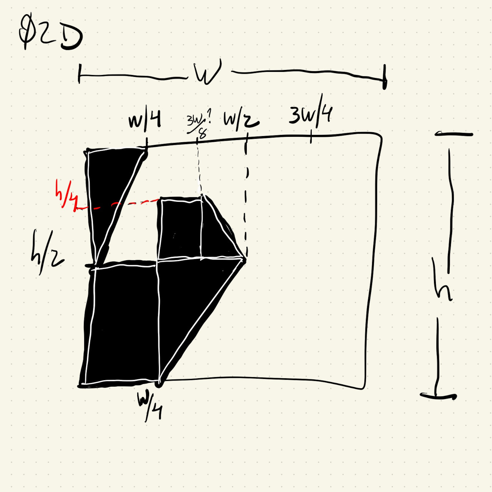

# HW02D

Recreating a Lygia Clark print.

I drew the following diagram to work out the location for the shapes:



The only point I wasn't too sure about was the one between ```W/4``` and ```W/2```. I guessed that smaller rectangle had a width of about 1/8 of the width of the canvas and it turned out to be pretty close.

Like most of the other prints from Lygia Clark there's a mirror symmetry around the line X=Y here, so for all the triangle points (x, y) on the left half of the canvas there's a corresponding triangle point at (W - x, H - y) on the right side.

The same is true for the rectangles, but because ```rect()``` takes width and height instead of points, after mirroring (x, y) -> (W - x, H - y) the rectangle width and height also have to be flipped: ```rect(x, y, w, h)``` -> ```rect(W - x, H - y, -w, -h)```.
